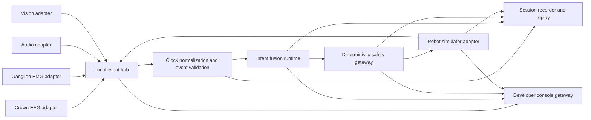

# General System Plan

## 1. Product objective

Build a local-first Multimodal Intent Compiler that converts available human signals into confidence-scored, machine-readable intentions. The current version operates a software robot simulator; the future version will operate an SO-ARM101 through the same approved action interface.

The product is not a thought reader. It estimates a small, explicit intent vocabulary from synchronized evidence and exposes its uncertainty.

## 2. Initial use case

Use a tabletop object-selection and handoff scenario with four visually distinct objects.

Supported actions:

- `SELECT_OBJECT`
- `REQUEST_HANDOFF`
- `CONFIRM`
- `CANCEL`
- `STOP`

Example flow:

1. User says, "Give me that object."
2. Audio identifies `REQUEST_HANDOFF` but leaves the target unresolved.
3. Vision ranks visible objects using pointing and head-direction evidence.
4. EMG indicates `CONFIRM` or `CANCEL`.
5. EEG reports quality and experimental readiness in shadow mode.
6. Fusion creates an `IntentDecision` with evidence and confidence.
7. The safety gateway returns `APPROVE`, `ASK_CONFIRMATION`, or `HOLD`.
8. The robot simulator executes only an approved command.
9. The outcome is stored and becomes a label for later evaluation.

## 3. System architecture



## 4. Technology decisions

### Languages

- Python 3.12: event hub, Crown EEG (BrainFlow OSC), EMG, audio, vision, fusion, safety, simulator, storage, API.
- TypeScript/Next.js: developer console.

### Local transport

Use ZeroMQ on localhost:

- Adapters `PUSH` events to `tcp://127.0.0.1:5555`.
- Event hub `PULL`s, validates, normalizes, and `PUB`lishes to `tcp://127.0.0.1:5556`.
- Runtime components and recorder `SUB`scribe to the normalized stream.
- Approved action commands use a separate `PUSH/PULL` path on `tcp://127.0.0.1:5557`.
- Session/trial control uses a local `REQ/REP` control plane on `tcp://127.0.0.1:5558` between the console API and event hub.
- The UI never connects directly to ZeroMQ; a FastAPI gateway converts selected events to WebSockets.

Adapters may emit preview/health events before a session and leave `session_id`/`trial_id` null. The event hub attaches the active IDs while normalizing recordable data. Derived runtime events must retain the IDs of their input decision context.

ZeroMQ is intentionally local and lightweight. Do not introduce Kafka, Redis, NATS, or cloud queues into the MVP.

### Data format

- JSON for control/event envelopes during the MVP.
- Pydantic models are the canonical Python schema.
- Zod models mirror schemas in TypeScript.
- Store numeric events as Parquet, audio as FLAC/WAV, video as MP4, and metadata as JSON.
- Add Protobuf only when external robot partners require a stable binary API.

## 5. Future repository layout

```text
multimodal-intent-compiler/
├── README.md
├── pyproject.toml
├── pnpm-workspace.yaml
├── Makefile
├── configs/
│   ├── local.yaml
│   ├── modalities.yaml
│   └── safety.yaml
├── packages/
│   ├── contracts-python/
│   └── contracts-ts/
├── services/
│   ├── event-hub/
│   ├── crown-adapter/
│   ├── ganglion-adapter/
│   ├── audio-adapter/
│   ├── vision-adapter/
│   ├── fusion-runtime/
│   ├── safety-gateway/
│   ├── robot-simulator/
│   ├── session-recorder/
│   └── console-api/
├── apps/
│   └── developer-console/
├── models/
│   ├── emg/
│   ├── eeg/
│   └── fusion/
├── data/
│   ├── sessions/
│   └── fixtures/
├── experiments/
├── tests/
│   ├── unit/
│   ├── contract/
│   ├── replay/
│   └── end_to_end/
└── scripts/
```

## 6. Build sequence

### Milestone 0 - Contracts and synthetic loop

Duration: 2-3 days.

Build shared schemas, event hub, session controller, rule-based fusion, safety gateway, simulator, and minimal console using generated fake signals. This proves architecture before involving hardware.

Exit criteria:

- Synthetic voice + target + confirm produces one simulated action.
- Contradiction produces `ASK_CONFIRMATION`.
- Cancel stops the simulator.
- Full event history replays deterministically.

### Milestone 1 - Biosignal acquisition

Duration: 4-6 days.

Integrate Crown and Ganglion. Validate packet rates, signal quality, timestamp behavior, device disconnects, and recordings.

Exit criteria:

- Twenty-minute concurrent recording without process failure.
- Packet loss and timestamp gaps are visible.
- No biosignal is used for control yet.

### Milestone 2 - Audio and vision

Duration: 4-6 days.

Implement constrained voice commands, four-object detection, hand pointing, and coarse head direction.

Exit criteria:

- Voice command accuracy exceeds 95% in the expected environment.
- Four marked objects are correctly identified in 95% of stationary frames.
- Pointing target top-1 accuracy exceeds 85% under the defined camera setup.

### Milestone 3 - EMG personalization

Duration: 5-7 days.

Collect and train `rest`, `confirm`, and `cancel` classes. Add calibration and model versioning.

Exit criteria:

- Cross-session balanced accuracy exceeds 85% for the primary user.
- False confirm/cancel rate is measured during a ten-minute rest trial.
- Predictions use dwell and hysteresis, not single-window commits.

### Milestone 4 - Closed-loop multimodal demo

Duration: 5-7 days.

Enable fusion, confidence thresholds, confirmation behavior, simulator actions, corrections, and replay.

Exit criteria:

- 100 scripted trials run end to end.
- No low-confidence trial executes automatically.
- Cancel stops every pending simulated action.
- Voice + vision + EMG outperforms voice only on ambiguity or corrections.

### Milestone 5 - EEG shadow experiment

Duration: 5-10 days.

Collect EEG readiness/error-response data. Do not allow EEG to commit actions. Measure incremental predictive value through offline ablation.

Exit criteria:

- EEG quality and motion artifacts are quantified.
- Offline evaluation compares all-input fusion with and without EEG.
- A documented decision determines whether EEG enters a future control loop.

### Milestone 6 - YC-ready packaging

Duration: 3-5 days.

Create a repeatable launcher, guided calibration, benchmark report, recorded demo, architecture page, privacy controls, and failure-recovery script.

## 7. Component ownership rules

- Adapters acquire and preprocess one modality; they do not fuse intent.
- The event hub validates transport and time; it does not infer meaning.
- The fusion runtime proposes intent; it does not command machines.
- The safety gateway approves or rejects actions through deterministic policy.
- The robot adapter executes approved commands and reports state.
- The recorder observes everything but changes nothing.
- The UI visualizes, labels, and requests operations through APIs; it does not contain hidden business logic.

## 8. Configuration

All adjustable values belong in versioned YAML:

- Device IDs and ports
- Sampling and window sizes
- Modality freshness limits
- Quality thresholds
- Fusion weights
- Decision thresholds
- Simulator timing
- Safety rules
- Storage retention

Never hide experimental thresholds in UI code.

## 9. Definition of production-ready for this stage

"Production-ready" here means a reliable research/developer preview, not a medical device or industrial safety controller.

It requires:

- One-command local startup and graceful shutdown.
- A preflight device check.
- Explicit session consent and recording state.
- Health checks for every service.
- Structured logs with session and correlation IDs.
- Automatic reconnection with bounded retries.
- No action when required inputs are stale.
- Versioned models, configs, and contracts.
- Reproducible replay tests.
- Raw biometric data remains local by default.
- A physical robot remains disabled until its separate integration checklist passes.

## 10. Instructions to Codex

When implementing this plan:

1. Start with synthetic fixtures and contract tests.
2. Keep services runnable independently.
3. Add a `--mock` option to every hardware adapter.
4. Provide health endpoints or heartbeat events.
5. Never place passwords or device credentials in Git.
6. Make timestamps and units explicit in every schema.
7. Reject invalid and future-version events rather than guessing.
8. Finish acceptance tests for one milestone before beginning the next.
